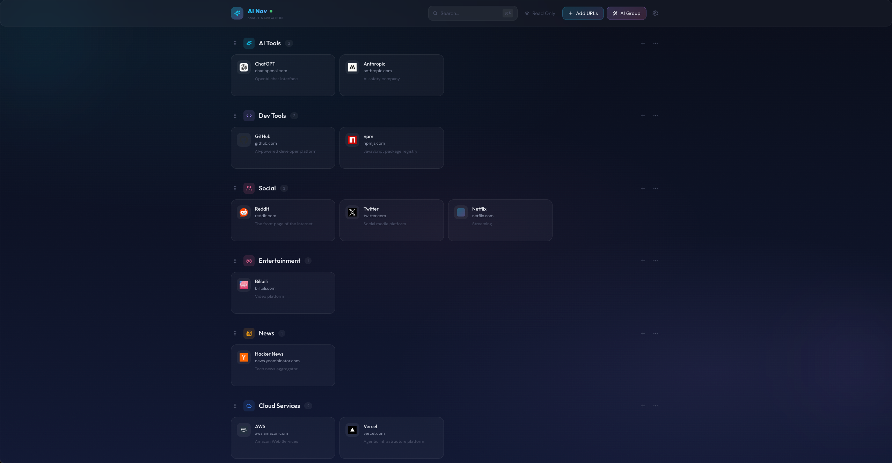

# AI Nav

> 智能导航首页 — 粘贴 URL，AI 自动提取元数据并分类

[](https://github.com/muzig/ai-nav/releases)
[](LICENSE)
[](https://react.dev)
[](https://vitejs.dev)
[](https://expressjs.com)
[](https://sqlite.org)

<p align="center">
  
</p>

## ✨ 功能特性

- **AI 智能分组** — 粘贴 1-100 个 URL，Claude 自动分析标题、描述并分类
- **拖拽排序** — 书签和分类支持拖拽重排
- **编辑/只读模式** — 一键切换编辑状态
- **内联搜索** — 主页直接过滤书签
- **批量导入** — 粘贴混合文本，自动提取 URL
- **分类管理** — 创建、编辑、删除分类，自定义颜色
- **书签 CRUD** — 完整的增删改查
- **毛玻璃 UI** — 暗色渐变背景 + 磨砂玻璃卡片
- **无 API Key 可用** — 自动降级为基于域名的启发式分类

## 🚀 快速开始

### 环境要求

- Node.js >= 18
- pnpm >= 9

### 安装与运行

```bash
# 克隆仓库
git clone https://github.com/muzig/ai-nav.git
cd ai-nav

# 安装依赖
pnpm install

# 配置环境变量
cp .env.example .env
# 编辑 .env，填入 CLAUDE_API_KEY（可选）

# 启动开发服务器
pnpm dev
```

打开 http://localhost:5173

### 环境变量

在项目根目录创建 `.env` 文件：

| 变量名 | 别名 | 说明 |
|--------|------|------|
| `CLAUDE_API_KEY` | `ANTHROPIC_API_KEY` | Anthropic API 密钥 |
| `BASE_URL` | `ANTHROPIC_BASE_URL` | 自定义 API 端点 |
| `MODEL` | `ANTHROPIC_MODEL` | Claude 模型名称 |

> 优先级：Settings UI（数据库）> 环境变量 > 默认值

## 📦 项目架构

```
ai-nav/
├── apps/
│   ├── web/                     # @ai-nav/web — React + Vite + Tailwind
│   │   └── src/
│   │       ├── components/      # Dashboard, NavCard, CategoryGroup, SearchBar
│   │       └── hooks/           # useBookmarks, useAI, useHealthCheck
│   └── api/                     # @ai-nav/api — Express + Claude SDK
│       └── src/
│           ├── routes/          # REST API 路由
│           └── services/        # 元数据提取、AI 分类
├── packages/
│   ├── shared/                  # @ai-nav/shared — 类型定义 & 常量
│   └── db/                      # @ai-nav/db — SQLite schema & 查询
├── turbo.json
└── pnpm-workspace.yaml
```

## 🔌 API 接口

| 方法 | 路径 | 说明 |
|------|------|------|
| `GET` | `/api/bookmarks` | 获取所有书签 |
| `POST` | `/api/bookmarks` | 创建书签 |
| `POST` | `/api/bookmarks/bulk` | 批量创建书签 |
| `PUT` | `/api/bookmarks/:id` | 更新书签 |
| `PUT` | `/api/bookmarks/reorder` | 重排书签 |
| `DELETE` | `/api/bookmarks/:id` | 删除书签 |
| `GET` | `/api/categories` | 获取所有分类 |
| `POST` | `/api/categories` | 创建分类 |
| `PUT` | `/api/categories/reorder` | 重排分类 |
| `POST` | `/api/ai/parse` | AI URL 分析 |
| `GET` | `/api/settings` | 获取设置 |
| `PUT` | `/api/settings` | 更新设置 |

## ⌨️ 快捷键

| 快捷键 | 功能 |
|--------|------|
| `⌘ K` | 搜索书签 |
| `⌘ N` | 添加书签 |
| `ESC` | 关闭弹窗 |

## 🛠️ 开发命令

```bash
pnpm dev              # 同时启动 web + api
pnpm dev:web          # 仅启动前端 (port 5173)
pnpm dev:api          # 仅启动后端 (port 3001)
pnpm build            # 构建所有包
pnpm typecheck        # 类型检查
pnpm lint             # 代码检查
```

## 🔒 隐私与安全

- 所有数据存储在本地 SQLite 数据库，不会上传到第三方服务器
- API 密钥仅存储在本地，用于调用 Anthropic Claude API
- 无遥测、无数据收集

## ⚠️ 免责声明

本项目为非官方第三方工具，与 Anthropic 无关联。使用 Claude API 须遵守 [Anthropic 使用条款](https://www.anthropic.com/terms)。本项目按"原样"提供，不附带任何保证。

## 📄 许可证

[MIT](LICENSE)
